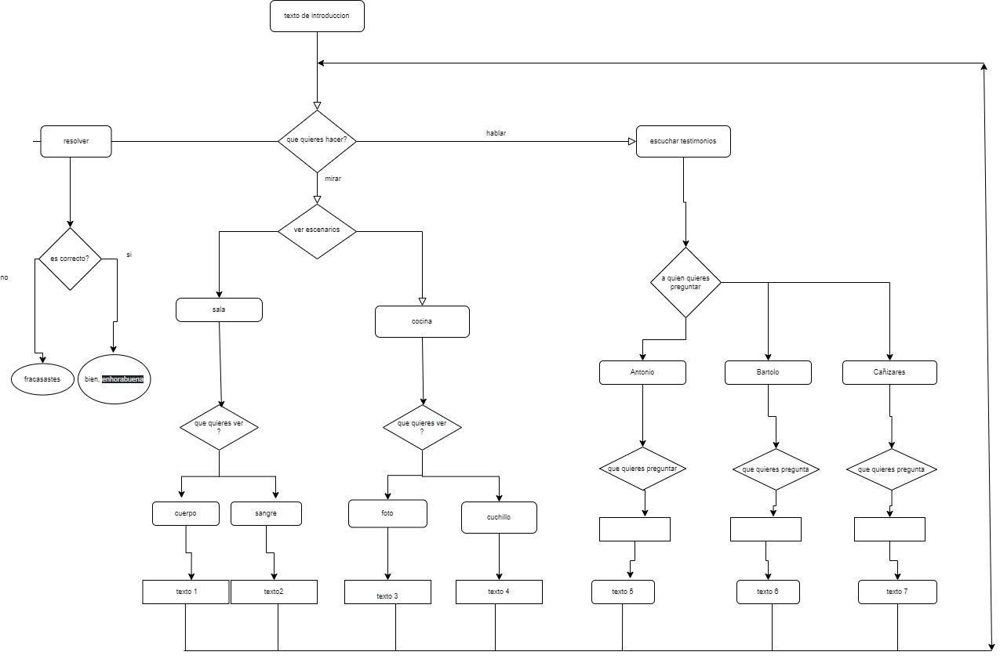
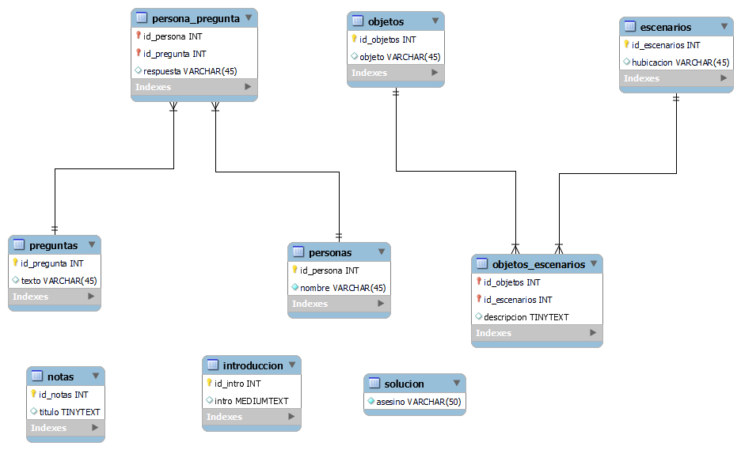

# Juego de misterio
Proyecto de clase cuyo objetivo es crear la base de un juego en donde te muestran opciones y según lo que decidas salte un texto u otro, con los datos o descripciones que te da poder resolver un misterio.
Por falta de habilidad escritora no se pudo hacer un misterio que se pueda resolver pero si la base para introducir los datos y poder jugar.
En una base de datos creada con mysql es donde se mete información como habitaciones, objetos, declaraciones, etc. 
Por java te describe por texto las opciones que tienes para obtener mas información y poder dar una respuesta.

## diagrama de java
El siguiente diagrama muestra como esta estructurado las rutas para si se quiere modificar y añadir lo que se quiera. Por ejemplo 
cambiar los nombres de los personajes , añadir preguntas o texto.



## Configuración de la base de datos

Esta es  el esquema donde están las tablas de donde java saca los textos, y se puede modificar.



## Codigo de mysql 
Codigo usado para acceder a las tablas de Mysql:

```

SELECT COUNT(title) FROM book;

-- comando ver escenarios con objetos
SELECT descripcion FROM objetos_escenarios WHERE id_escenarios = 2 AND id_objetos = 3;

-- comando preguntar peña

SELECT respuesta FROM persona_pregunta WHERE id_persona = 1 AND id_pregunta = 1;

-- intro 
SELECT intro FROM introduccion;

-- ver escenarios
SELECT hubicacion, id_escenarios FROM escenarios ORDER BY id_escenarios ASC;

-- ver objetos en un eccenario

SELECT o.id_objetos, objeto FROM objetos_escenarios oe , objetos o WHERE oe.id_objetos= o.id_objetos AND oe.id_escenarios = 2 ;

-- ver descripccion de los objetos

SELECT descripcion FROM objetos_escenarios oe , objetos o WHERE oe.id_objetos= o.id_objetos AND oe.id_escenarios = 2 AND oe.id_objetos= 4;

-- ver asesino
SELECT asesino FROM respuesta;

SELECT descripcion FROM objetos_escenarios oe , objetos o WHERE oe.id_objetos= o.id_objetos AND oe.id_escenarios = 4  AND oe.id_objetos= 2 ;

-- preguntar al asesino
-- personas
SELECT id_persona,nombre FROM personas;
SELECT id_pregunta, texto FROM preguntas;

SELECT respuesta, nombre FROM personas p, persona_pregunta pp, preguntas 
WHERE p.id_persona=pp.id_persona AND pp.id_pregunta = preguntas.id_pregunta
AND p.id_persona =  2 AND preguntas.id_pregunta= 1  ;

-- notas
-- añadir notas
INSERT INTO misterio.notas (titulo, apuntes) VALUES ('pruebatitulo', 'pruebaapuntes');
-- quitar notas
DELETE FROM misterio.notas WHERE (id_notas = '1');
-- ver notas
SELECT id_notas,titulo FROM notas ;
-- ver una nota en concreto
SELECT titulo, apuntes FROM notas WHERE id_notas = 1 ;


``` 