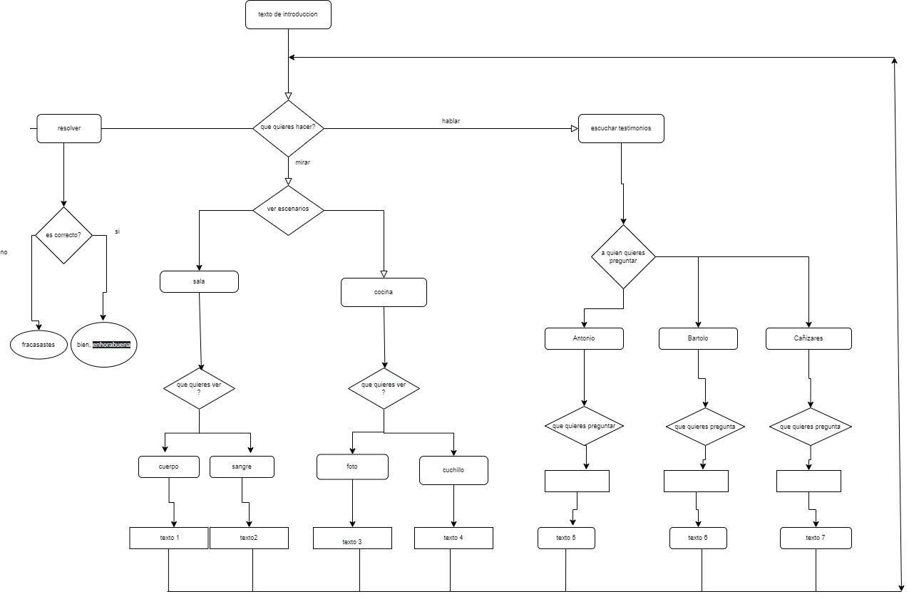
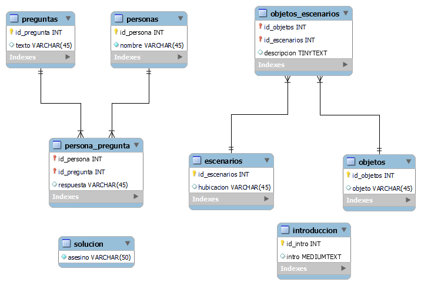

# Juego de misterio
El objetivo es crear la base de un juego en donde te muestran opciones y segun lo que decidad salte un texto u otro, con los datos o descripciones que te da poder resolver un misterio.
Por falta de habilidad escritora no se pudo hacer un misterio que se pueda resolver pero si la base para introducir los datos y poder jugar.
En una base de datos creada con mysql es donde se mete informacion como habitaciones, objetos, declaraciones, etc. 
Por java te describe por texto las opciones que tienes para optener mas informacion y poder dar una respuesta.

## diagrama de java
El siguiente diagrama muestra como esta estructurado las rutas para si se quiere modificar y añadir lo que se quiera. Por ejemplo 
cambiar los nombres de los personajes , añadir preguntas o texto.

## Configuración de la base de datos

Esta es  el esquema donde estan las tablas de donde java saca los textos, y se puede modificar 

